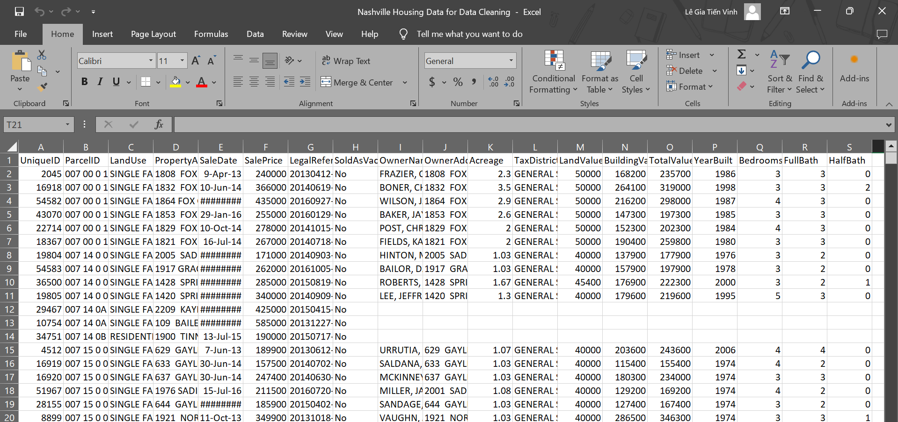
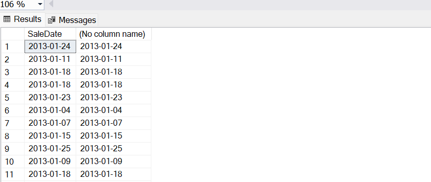
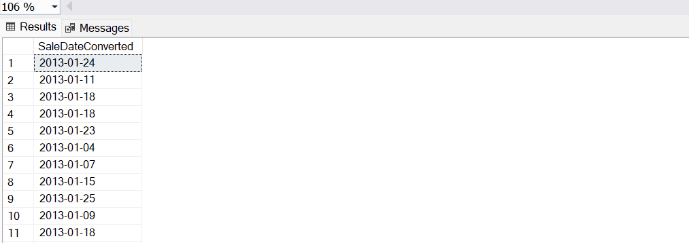
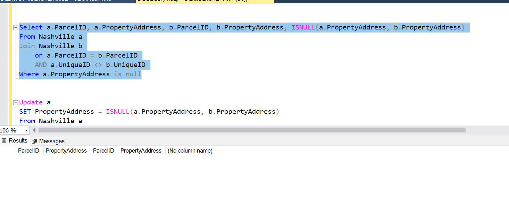
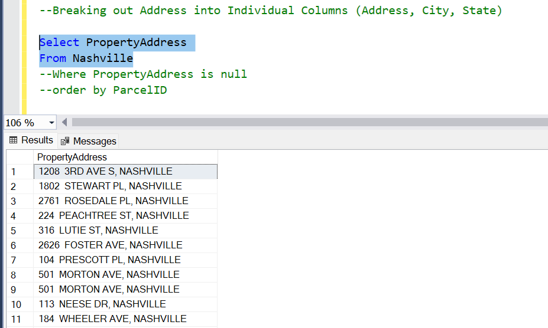
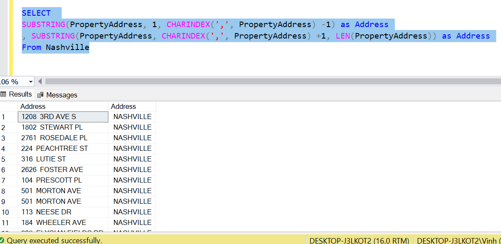
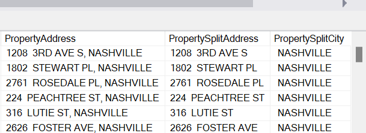
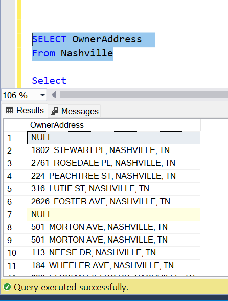
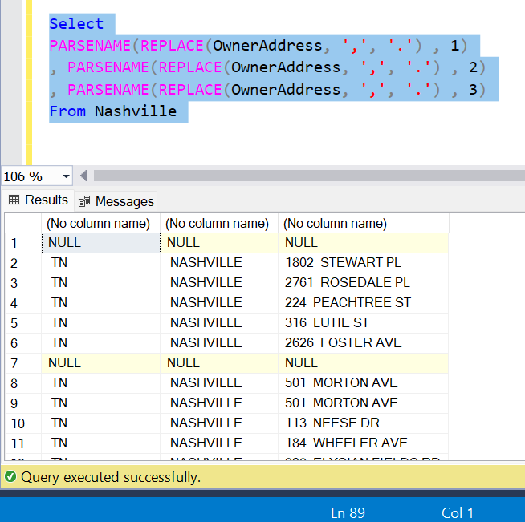
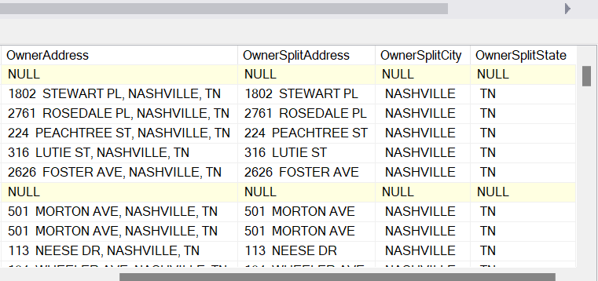

# Nashville Housing Data Cleaning by SQL Server

**Industry Focus:**

Focusing on real estate, particularly property transactions, valuations, and characteristics in the Nashville area.

**Problem Statement:**

The dataset is messy, containing missing values, inconsistent formatting, and potentially erroneous entries. Such issues hinder reliable analysis and decision-making for stakeholders in the real estate market, such as property investors, buyers, and urban planners. Cleaning this dataset is critical for deriving accurate insights.

**Goals:**

**Clean and Standardize the Dataset**:
  - Address missing values in key columns (e.g., OwnerName, YearBuilt).
  - Correct inconsistent or incorrect formats in SaleDate and SalePrice.
  - Ensure uniformity in categorical fields like LandUse and TaxDistrict.

**Improve Data Quality**:
  - Identify and handle duplicate entries.
  - Validate relationships (e.g., SalePrice aligns with TotalValue).

**Enable Analysis and Reporting**:
  - Prepare the dataset for housing market trend analysis.
  - Ensure it supports visualization and statistical reporting.

**Facilitate Predictive Modeling**: Provide a high-quality dataset for applications like property price prediction or market segmentation.

**Business Use Case:**

The primary goal of these cleaning tasks is to prepare a high-quality, standardized, and comprehensive dataset that supports reliable analytics, trend reporting, and predictive modeling in the real estate industry.

Overview of the data:

1. Standardlizing format and value

Update SaleDate to “Sale” format:

Update Nashville

SET SaleDate = CONVERT(Date,SaleDate)

Add new column named SaleDateConverted:

ALTER TABLE Nashville

Add SaleDateConverted Date;

Update Nashville

SET SaleDateConverted = CONVERT(Date, SaleDate)

2. Filling Missing Data

Populate Property Address Data

Update a

SET PropertyAddress = ISNULL(a.PropertyAddress, b.PropertyAddress)

From Nashville a

Join Nashville b

on a.ParcelID = b.ParcelID

AND a.UniqueID <> b.UniqueID

Where a.PropertyAddress is null

3. Spliting Complex Column

Split PropertyAddress to 2 different column: Address & City

ALTER TABLE Nashville

Add PropertySplitAddress Nvarchar(255);

Update Nashville

SET PropertySplitAddress = SUBSTRING(PropertyAddress, 1, CHARINDEX(',', PropertyAddress) -1)

ALTER TABLE Nashville

Add PropertySplitCity Nvarchar(255);

Update Nashville

SET PropertySplitCity = SUBSTRING(PropertyAddress, CHARINDEX(',', PropertyAddress) +1, LEN(PropertyAddress))

Split Sucessful, now we have PropertyAddress and 2 split column named Address & City

Split OwnerAddress to 3 different column named Adress, City and State

ALTER TABLE Nashville

Add OwnerSplitAddress Nvarchar(255);

Update Nashville

SET OwnerSplitAddress = PARSENAME(REPLACE(OwnerAddress, ',', '.') , 3)

ALTER TABLE Nashville

Add OwnerSplitCity Nvarchar(255);

Update Nashville

SET OwnerSplitCity = PARSENAME(REPLACE(OwnerAddress, ',', '.') , 2)

ALTER TABLE Nashville

Add OwnerSplitState Nvarchar(255);

Update Nashville

SET OwnerSplitState = PARSENAME(REPLACE(OwnerAddress, ',', '.') , 1)

Split Successful, now we have more 3 new column splited to Address, City and State

4. Removing Duplicate Records

WITH RowNumCTE AS(

Select \*,

ROW_NUMBER() OVER (

PARTITION BY ParcelID,

PropertyAddress,

SalePrice,

SaleDate,

LegalReference

ORDER BY

UniqueID

) row_num

From Nashville

\--Order by ParcelID

)

DELETE

From RowNumCTE

Where row_num > 1

5. Optimizing and Simplifing the Dataset: Delete Unused Column include: OwnerAddress, TaxDistrict and PropertyAddress

ALTER TABLE Nashville

DROP COLUMN OwnerAddress, TaxDistrict, PropertyAddress

ALTER TABLE Nashville

DROP COLUMN SaleDate
